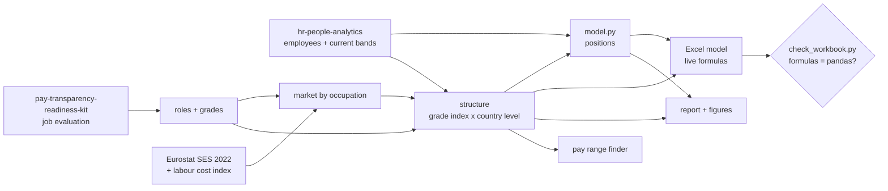

# Equal-Value Pay Ranges

A multinational pays through bands built family by family: at the same level, Tech earns more than
Customer Service, and every country gets a fixed share of the Italian scale. The EU Pay Transparency
Directive asks for pay structures that compare **work of equal value** (Article 4), a pay range in
**every job advertisement** (Article 5) and **open criteria for progression** (Article 6). This
repository redesigns the structure **as a reward team would**: one range per grade and country,
priced on real Eurostat market data, every employee placed against it, the cost of the move, and the
range to publish for every role.

[](https://github.com/D0M3N1C0X/equal-value-pay-ranges/actions/workflows/ci.yml)


> **Synthetic employees, real market.** The workforce and its current bands are the organisation
> analysed in [hr-people-analytics](https://github.com/D0M3N1C0X/hr-people-analytics); the job
> evaluation is the one in [pay-transparency-readiness-kit](https://github.com/D0M3N1C0X/pay-transparency-readiness-kit).
> Market figures are Eurostat's, with every source in the [verification register](docs/verification.md).
> Not legal or pay advice.

### ▶ [Read the report](https://d0m3n1c0x.github.io/equal-value-pay-ranges/) · [Pay range finder](https://d0m3n1c0x.github.io/equal-value-pay-ranges/ads.html) · [Download the Excel model](https://github.com/D0M3N1C0X/equal-value-pay-ranges/raw/main/deliverables/equal_value_pay_ranges.xlsx)

---

## The answer, for the head of reward

| | |
|---|---|
| **The bands pay the family, not the job.** At the same level Tech's midpoint is 39% above Customer Service's; inside one grade of equal value, midpoints differ by up to 74%. | **One scale, four markets.** Against large employers for the same occupations, payroll is +13.6% in Poland, −1.0% in Spain, −7.0% in Italy and −9.7% in Germany. The bands put Poland at 81% of Italy; the market at 66%. |
| **Bringing everyone to the new minimum costs €3.02M a year for 824 people, 58% of it for women.** In Italy 42% of women fall below the minimum against 26% of men. | **739 people sit above their new maximum, €3.48M a year, 66% of it in Poland**: pay protected, not cut, while the ranges catch up. |


---

## What you get

| Deliverable | For | What is in it |
|---|---|---|
| [`equal_value_pay_ranges.xlsx`](deliverables/equal_value_pay_ranges.xlsx) | the reward team | Ten sheets: summary, the 28 ranges with a chart per country, the range to advertise for all 144 role-country pairs, every employee against the new range, the roles and their evaluation, the current bands, the Eurostat inputs and a reconciliation sheet. **Every figure is a live formula**: change a spread, a positioning or a factor weight and the structure recalculates. |
| [Report](reports/report.md) | the HR director | Answer first: how the bands are built, the market by country, the new structure, who moves and what it costs, advertised ranges, recommendations, method and limits. |
| [Pay range finder](site/ads.html) | recruiters | One HTML page: pick an entity, a family and a level, get the range to publish and a sentence to paste into the advertisement. |
| [`tableau/`](tableau/) | a live dashboard | Tidy extracts and a build sheet for Tableau Public. |
| [`docs/`](docs/) | reviewers | The method step by step, and the source and status of every external fact. |

## What this project demonstrates

| Reward and employment law | Analytics | Delivery and engineering |
|---|---|---|
| Job architecture: grades of equal value from a points-factor evaluation on the Article 4(4) criteria | Market pricing on public data: occupations matched to ISCO-08, Eurostat earnings aged with the labour cost index, a large-employer premium derived rather than assumed | A client-ready Excel model: inputs in blue, formulas in black, assumptions in one Settings sheet, no dynamic arrays |
| Range design: midpoint progression, spreads, positioning, red circles | Compa-ratio and range penetration for 3,443 employees, costed by country, gender and family | **Two engines, one answer:** pandas and Excel reconciled on 1,315 checks, recalculated in CI by LibreOffice |
| Articles 5 and 6 in practice: a range for every vacancy, criteria for progression | Sensitivity of Poland's position to the positioning policy | A self-contained range finder, Tableau extracts, deterministic outputs, tests for every identity |

## How it fits together



## Run it

```bash
python3 -m venv .venv && . .venv/bin/activate
pip install -r requirements.txt
python src/run_all.py        # about ten seconds
```

Tests, including a sample workbook calculated in pure Python and checked against pandas:

```bash
pip install -r requirements-dev.txt
pytest
```

The full workbook is recalculated by LibreOffice in CI:

```bash
python src/recalc_libreoffice.py deliverables/equal_value_pay_ranges.xlsx build/
python src/check_workbook.py build/equal_value_pay_ranges.xlsx
```

## What's inside

```
├── data/
│   ├── source/            employees (hr-people-analytics) and job evaluation (kit), checksums pinned
│   ├── isco_map.csv       the occupation that stands in for each role, with a rationale
│   └── raw/eurostat/      API snapshots with address and retrieval date
├── src/
│   ├── config.py          every assumption in one place
│   ├── model.py           roles, market, grade index, structure, positions, advertised ranges
│   ├── build_workbook.py  the Excel model and its reconciliation sheet
│   ├── check_workbook.py  proves the formulas reproduce pandas
│   ├── build_report.py    the report and its figures
│   ├── build_site.py      the pay range finder and the Tableau extracts
│   ├── fetch_eurostat.py  refreshes the snapshots (optional)
│   └── run_all.py         the whole pipeline
├── deliverables/          the workbook
├── reports/               the report, its HTML page and figures
├── site/                  the pay range finder
├── tableau/               extracts and the build sheet
├── docs/                  method and verification register
└── tests/
```

## Choices worth knowing

- **Grades come from the job evaluation**, not from levels: a Customer Service L1 and a Tech L2 share
  a grade.
- **The market sets the level, the company sets the shape.** Eurostat publishes occupations, not
  levels, so the progression between grades comes from today's bands with the family premiums averaged
  out, and at least 8% per grade.
- **The country level is fitted on grades A–E.** ISCO group 1 puts every manager in one average.
- **Pay above the new maximum is protected, not cut.**
- **Poland advertises monthly pay**, the others annual, as their job markets do.

Full reasoning in [docs/method.md](docs/method.md).

## About

Built by **Domenico Perroni** — HR advisory, people analytics and media education, based in Kraków.
[GitHub profile](https://github.com/D0M3N1C0X) · [LinkedIn](https://www.linkedin.com/in/domenico-perroni) · [ORCID](https://orcid.org/0009-0001-8806-5188)

**More from the same portfolio**

- [pay-transparency-readiness-kit](https://github.com/D0M3N1C0X/pay-transparency-readiness-kit) — the Directive's reporting exercise on the same organisation: a live Excel model reconciled with pandas, a board briefing and a readiness checklist; its job evaluation grades this structure
- [workforce-cost-model](https://github.com/D0M3N1C0X/workforce-cost-model) — the people budget of the same organisation: employer costs in Italy and Poland, budget variance and scenarios, with the [memo online](https://d0m3n1c0x.github.io/workforce-cost-model/)
- [where-pay-transparency-bites](https://github.com/D0M3N1C0X/where-pay-transparency-bites) — Eurostat data for all 27 Member States, analysed in R: the published gender pay gap understates the gap inside sectors; [article](https://d0m3n1c0x.github.io/where-pay-transparency-bites/) and [working paper](https://d0m3n1c0x.github.io/where-pay-transparency-bites/paper.pdf)
- [hr-people-analytics](https://github.com/D0M3N1C0X/hr-people-analytics) — attrition drivers, pay-equity exposure and HR service-desk performance on the synthetic 4,000-employee organisation used here, with the [report online](https://d0m3n1c0x.github.io/hr-people-analytics/)
- [engagement-survey-analytics](https://github.com/D0M3N1C0X/engagement-survey-analytics) — an engagement survey analysed end to end, with a [live dashboard](https://d0m3n1c0x.github.io/engagement-survey-analytics/)
- [pompei-stratificata](https://github.com/D0M3N1C0X/pompei-stratificata) — Pompeii and Herculaneum from AD 79 to today, a [walkable model](https://d0m3n1c0x.github.io/pompei-stratificata/) with a sourced documentary dossier

MIT licensed. Reuse anything here.
