# From family bands to equal-value pay ranges

**Scope:** IT · Milan, PL · Kraków, DE · Munich and ES · Barcelona; 3,443 employees on the payroll at 30 June 2026, 36 roles in six families
**Market:** Eurostat Structure of Earnings Survey 2022 by occupation, aged to mid-2026 with the labour cost index, plus a 8.1% large-employer premium
**Data:** employees and current bands synthetic, from [hr-people-analytics](https://github.com/D0M3N1C0X/hr-people-analytics); job evaluation from [pay-transparency-readiness-kit](https://github.com/D0M3N1C0X/pay-transparency-readiness-kit); market figures real, with their sources in [docs/verification.md](../docs/verification.md)

> The Pay Transparency Directive asks for pay structures that compare work of equal value on objective, gender-neutral criteria (Article 4), a pay range for every vacancy (Article 5) and accessible criteria for pay and progression (Article 6). This review tests the company's bands against all three. Not legal advice.

## The answer

- **The current bands pay the family, not the job.** At the same level, Tech's midpoint is 39% above Customer Service's. Inside grade B, Tech L2 (185 points) has a midpoint 74% above Customer Service L1 (175 points). The evaluation gives no reason for the difference; if the company keeps it, it needs a documented one.
- **One pay scale, four markets.** Against large employers for the same occupations, payroll is +13.6% in Poland, −1.0% in Spain, −7.0% in Italy and −9.7% in Germany. The bands put Poland at 81% of Italy; the market puts it at 66%.
- **Bringing everyone to the new minimum costs €3.02M a year for 824 people, 58% of it for women.** In Italy 42% of women fall below the minimum against 26% of men. The families the bands pay least employ more women: Customer Service is 55% women and HR 58%, Tech 41%.
- **739 people are paid above their new maximum, €3.48M a year, 66% of it in Poland.** Their pay is protected, not cut; at Polish wage growth the ranges catch up in about 1.3 years.
- **Every role now has a range to advertise.** Customer Service L1: EUR 27,500 – 36,000 gross per year in Italy, PLN 6,400 – 8,500 gross per month in Poland. All 144 are in [the workbook](../deliverables/equal_value_pay_ranges.xlsx) and the [range finder](../site/ads.html).

## 1. How the current bands are built

Each band midpoint is a country factor times a family premium times a level step. At every level the premium is the same:

| Family | Italy L3 midpoint | vs Customer Service | Share of staff | Women |
|---|---:|---:|---:|---:|
| Customer Service | €37k | +0% | 29% | 55% |
| Operations | €40k | +6% | 25% | 48% |
| Tech | €52k | +39% | 16% | 41% |
| Sales | €44k | +17% | 13% | 51% |
| Finance | €46k | +22% | 10% | 47% |
| HR | €42k | +11% | 8% | 58% |

The job evaluation scores the four Article 4(4) criteria (skills, effort, responsibility, working conditions) and groups roles into seven grades of equal value. Customer Service and Operations score high on effort and working conditions, which the family premiums ignore.

## 2. The market, country by country

Each role is matched to an ISCO major group (a contact centre agent to clerical support workers, a Tech L3 to professionals) and priced on Eurostat's mean base pay for that group: earnings minus annual bonuses, aged from 2022 with the labour cost index for wages and salaries, and raised by 8.1%, what enterprises of 1,000+ pay over enterprises of 10+ in Germany, Spain and Poland (Italy's figure is confidential).

| Entity | Payroll against market | Current bands vs Italy | Market vs Italy | Labour cost growth, 2025 |
|---|---:|---:|---:|---:|
| IT · Milan | −7.0% | 100% | 100% | 3.0% |
| PL · Kraków | +13.6% | 81% | 66% | 8.9% |
| DE · Munich | −9.7% | 146% | 151% | 3.9% |
| ES · Barcelona | −1.0% | 96% | 90% | 3.0% |

*Grades A–E only: ISCO group 1 averages every manager, from a shop manager to an Italian dirigente, so it is not a fair yardstick for grades F and G.*

## 3. The new structure

One range per grade and country. The **midpoint** is the country's market level times a grade index: the progression between grades in today's bands, with the family premiums averaged out and each grade at least 8% above the one below. The **range** runs from 30% wide at grade A to 60% at grade G.

| Grade | Index | IT · Milan | PL · Kraków | DE · Munich | ES · Barcelona |
|---|---:|---:|---:|---:|---:|
| A | 0.66 | 25,592 – 33,270 | 72,081 – 93,706 | 38,675 – 50,278 | 23,112 – 30,046 |
| B | 0.71 | 27,640 – 35,932 | 77,848 – 101,202 | 41,770 – 54,300 | 24,961 – 32,449 |
| C | 0.77 | 29,851 – 38,806 | 84,076 – 109,298 | 45,111 – 58,644 | 26,958 – 35,045 |
| D | 1.00 | 37,095 – 51,933 | 104,479 – 146,270 | 56,058 – 78,482 | 33,500 – 46,900 |
| E | 1.31 | 48,686 – 68,160 | 137,124 – 191,974 | 73,574 – 103,004 | 43,967 – 61,554 |
| F | 1.81 | 64,545 – 96,817 | 181,792 – 272,688 | 97,541 – 146,311 | 58,289 – 87,434 |
| G | 2.51 | 86,058 – 137,692 | 242,383 – 387,813 | 130,052 – 208,082 | 77,717 – 124,348 |

*Full-time annual base pay: euro, Poland in zloty. The grade index is 1 at grade D.*

## 4. Who moves

| Entity | Below minimum | Above maximum | Cost to minimum | of which women | Pay above maximum | Years to absorb |
|---|---:|---:|---:|---:|---:|---:|
| IT · Milan | 357 | 123 | €1.14M | 63% | €0.52M | 3.0 |
| PL · Kraków | 75 | 473 | €0.10M | 54% | €2.28M | 1.3 |
| DE · Munich | 293 | 62 | €1.57M | 54% | €0.29M | 1.3 |
| ES · Barcelona | 99 | 81 | €0.22M | 63% | €0.38M | 3.2 |

*Costs are annual full-time-equivalent base pay, before employer contributions. Years to absorb: the median time for the maximum to reach a frozen salary at the country's 2025 labour cost growth.*

Poland's position is a policy choice the company never made explicitly. Setting its midpoints above the local market changes the picture:

| Poland positioned at | Below minimum | Above maximum | Pay above maximum | Cost to minimum |
|---|---:|---:|---:|---:|
| 100% | 6% | 41% | €2.28M | €0.10M |
| 110% | 14% | 22% | €1.13M | €0.33M |
| 120% | 29% | 12% | €0.50M | €0.83M |

*The wider the positioning, the more staff fall below the minimum instead: Polish pay is dispersed more widely than a single range can hold.*

## 5. Job advertisements and progression

Article 5 gives applicants the right to the starting pay or its range before the interview, based on objective, gender-neutral criteria, and bars employers from asking about pay history. The range for each role follows from its grade:

| Role | Grade | IT · Milan | PL · Kraków | DE · Munich | ES · Barcelona |
|---|---|---|---|---|---|
| Customer Service L1 | B | EUR 27,500 – 36,000 per year | PLN 6,400 – 8,500 per month | EUR 41,500 – 54,500 per year | EUR 24,500 – 32,500 per year |
| Operations L2 | C | EUR 29,500 – 39,000 per year | PLN 7,000 – 9,200 per month | EUR 45,000 – 59,000 per year | EUR 26,500 – 35,500 per year |
| Tech L3 | D | EUR 37,000 – 52,000 per year | PLN 8,700 – 12,200 per month | EUR 56,000 – 78,500 per year | EUR 33,000 – 47,000 per year |
| Finance L4 | E | EUR 48,500 – 68,500 per year | PLN 11,400 – 16,000 per month | EUR 73,500 – 103,500 per year | EUR 43,500 – 62,000 per year |
| Sales L5 | F | EUR 64,500 – 97,000 per year | PLN 15,100 – 22,800 per month | EUR 97,500 – 146,500 per year | EUR 58,000 – 87,500 per year |

Rounded outwards to €500 or PLN 1,000 a year (PLN 100 a month), so the published range always contains the real one. Poland advertises monthly gross pay, as its job market does; the others annual. Article 6 then asks for the criteria that move someone through the range: the proposal is time in grade and performance against the role's objectives, with position in range reviewed each year.

## 6. Recommendations

1. **Adopt one structure by grade.** Keep a family premium only where the company can document an objective, gender-neutral market reason, review it every year, and have counsel test it against national law.
2. **Close the gaps to the minimum over two pay reviews**, starting with the grades where women are furthest below: €3.02M a year in total.
3. **Protect pay above the maximum, don't cut it.** Hold increases to lump sums until the range catches up, and say so in writing to the people affected.
4. **Decide Poland's positioning deliberately.** Paying above the local market can be a sound retention choice in Kraków; it should be a decision with a number, not the side-effect of a single scale.
5. **Publish ranges in every vacancy** in the countries that have transposed Article 5, and remove pay-history questions from applications and interviews.
6. **Price the jobs on a salary survey before implementing.** Eurostat gives reliable country levels by occupation, not level-by-level market rates.

## 7. Method and limits

- **Two engines, one answer.** Every figure is computed in pandas and again by live formulas in [the workbook](../deliverables/equal_value_pay_ranges.xlsx); its Reconciliation sheet checks each pair, and CI recalculates the workbook with LibreOffice.
- **Occupations, not jobs.** ISCO major groups are broad and earnings are means, which sit above medians. The market sets each country's level; it cannot price the step from team lead to manager.
- **Synthetic company.** Employees, salaries and current bands come from a synthetic organisation, whose country pay levels were set without reference to the market; the gap to the market is part of the case.
- **Collective agreements.** In Italy and Spain sector agreements set minimum pay by level; any range sits on top of them. Full method in [docs/method.md](../docs/method.md).

